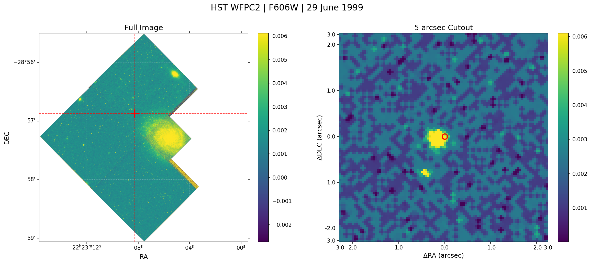

# Check HST Coverage

A Python tool to quickly check and download Hubble Space Telescope (HST) images covering a specific celestial coordinate or named object.

## Overview

This tool queries the MAST (Mikulski Archive for Space Telescopes) database to:
- Check for HST observations at a given position
- Display available observations with instrument, filter, and date information
- Download science-ready FITS images (e.g., DRZ files)
- Generate preview plots showing the full image and a 5 arcsecond cutout centered on the target

## Features

- **Coordinate Resolution**: Automatically resolve TNS (Transient Name Server) object names to coordinates using SIMBAD
- **Coverage Check**: Query HST observations within a specified search radius
- **Smart Filtering**: Prioritize observations that actually overlap with the target coordinates using polygon checks
- **Automatic Downloads**: Download HST science products (DRZ, FLT, etc.) directly from MAST
- **Organized Output**: Files automatically organized into `{FILTER}_{YYYYMMDD}/` subfolders
- **Preview Generation**: Create two-panel plots with:
  - Full image with WCS RA/DEC axes
  - 5 arcsecond cutout centered on target with ΔRA/ΔDEC in arcseconds
  - ZScale contrast scaling (DS9-like)
  - Crosshairs at target position
  - Hollow circle marker on cutout
  - Observation metadata (instrument, filter, date)

## Installation

### Requirements

- Python 3.7+
- astropy
- astroquery
- matplotlib
- numpy

### Install Dependencies

```bash
pip install astropy astroquery matplotlib numpy
```

## Usage

### Basic Usage with TNS Name

Check HST coverage for a named object (e.g., SN 2009ip):

```bash
python3 check_HST_coverage.py --tns "SN 2009ip"
```

### Download and Plot

To download images and generate preview plots:

```bash
python3 check_HST_coverage.py --tns "SN 2009ip" --download --plot
```

### Using Coordinates Directly

If you know the RA and DEC coordinates:

```bash
python3 check_HST_coverage.py --ra 335.784417 --dec -28.947889 --download --plot
```

### Command-Line Options

```
--tns "OBJECT_NAME"       # TNS object name to resolve (e.g., "SN 2023fyq")
--ra RA                   # Right Ascension in degrees
--dec DEC                 # Declination in degrees  
--radius RADIUS           # Search radius in degrees (default: 0.1)
--download                # Download HST images
--plot                    # Generate preview plots
--max-images N            # Maximum number of images to download (default: 1)
--file-type TYPE          # File type to download: flt, drz, crj (default: flt)
--output-dir DIR          # Output directory for downloads
```

## Example: SN 2009ip

SN 2009ip is a well-known Luminous Blue Variable (LBV) star in NGC 7259. Let's check what HST data is available:

```bash
python3 check_HST_coverage.py --tns "SN 2009ip" --download --plot
```

### Expected Output

**Console Output:**
```
Resolved TNS name 'SN 2009ip' to RA=335.784417, DEC=-28.947889
Output directory: SN_2009ip
Sorting observations by date (oldest first)...

Searching for HST observations at RA=335.784417, DEC=-28.947889
Search radius: 0.1 deg
============================================================

Total observations in region: 559
HST observations: 180

Filtering for observations that overlap with target coordinates...
Observations overlapping target: 46

================================================================================
Instrument      Filter               Obs ID               RA           DEC         
================================================================================
WFPC2/PC        F606W                hst_6359_40_wfpc2_pc_f606w_u33240 335.773333   -28.955000   
ACS/WFC         F435W                hst_10565_09_acs_wfc_f435w_ickj02 335.784417   -28.947889   
ACS/WFC         F555W                hst_10565_09_acs_wfc_f555w_ickj02 335.784417   -28.947889   
ACS/WFC         F814W                hst_10565_09_acs_wfc_f814w_ickj02 335.784417   -28.947889   
...

HST coverage found! 46 observations available.

Downloading HST products (max 1 files, type: FLT)...
============================================================
Found 46 observations with data products
Found 133 products
Found 8 FLT files
Downloading 1 products...
Moved u3324001r_flt.fits to F606W_19990629/   # or Unknown_19990629/

Creating plot from 1 images...
============================================================
Plot saved to: SN_2009ip/F606W_19990629/u3324001r_flt.png
  File size: 1069.6 KB
```

### Directory Structure

After running, you'll have:

```
SN_2009ip/
└── F606W_19990629/              # Oldest observation (June 29, 1999)
    ├── u3324001r_flt.fits       # Flat-fielded HST image (individual exposure)
    └── u3324001r_flt.png        # Preview plot
```

**Note**: The tool now:
- Downloads FLT files by default (individual exposures for time-series analysis)
- Sorts observations by date (oldest first)
- Organizes files into `{FILTER}_{YYYYMMDD}/` subfolders

For science-ready drizzled images, use `--file-type drz`.

### Example Output Plot

The generated preview plot shows:
- **Left Panel**: Full HST image with WCS coordinates (RA/DEC) and crosshairs at target position
- **Right Panel**: 5 arcsecond cutout centered on SN 2009ip with:
  - ΔRA and ΔDEC axes in arcseconds (1 arcsec tick spacing)
  - Hollow circle marker at target position
  - ZScale contrast for optimal image display



## Use Cases

### 1. Supernova Follow-up

Check for pre-explosion HST imaging of supernovae:

```bash
python3 check_HST_coverage.py --tns "SN 2023A" --download --plot --max-images 5
```

### 2. Variable Star Studies

Monitor variable stars with multi-epoch HST data:

```bash
python3 check_HST_coverage.py --tns "SN 2009ip" --download --plot --file-type flt --max-images 10
```

### 3. Galaxy Field Monitoring

Check any position for HST coverage:

```bash
python3 check_HST_coverage.py --ra 150.0 --dec 2.5 --radius 0.2 --download --plot
```

### 4. Download Specific File Types

Available file types:
- `flt`: Flat-fielded images (default, individual exposures for time-series analysis)
- `drz`: Drizzled science images (science-ready, for photometry/morphology)
- `crj`: Cosmic ray rejected images

**Default is FLT** for time-domain astronomy and variability studies. For ready-to-use science images:

```bash
python3 check_HST_coverage.py --tns "SN 2009ip" --download --file-type drz --max-images 3
```

## Troubleshooting

### No Images Found
- Increase search radius: `--radius 0.5`
- Check if the object name resolves correctly
- Verify coordinates are in decimal degrees

### Download Issues
- The MAST database may require authentication for some proprietary data
- Some observations may not have science products available

### Plot Generation
- If plots fail, ensure matplotlib and astropy are properly installed
- Check that the FITS file has valid WCS header information

## License

MIT License

## Author

Sean Brennan (@Astro-Sean)

## Acknowledgments

- This tool uses the [astroquery](https://astroquery.readthedocs.io/) library to query MAST
- Drizzled images processed using [AstroDrizzle](https://www.stsci.edu/scientific-community/software/astrodrizzle.html)
- ZScale implementation from [astropy.visualization](https://docs.astropy.org/en/stable/visualization/index.html)
